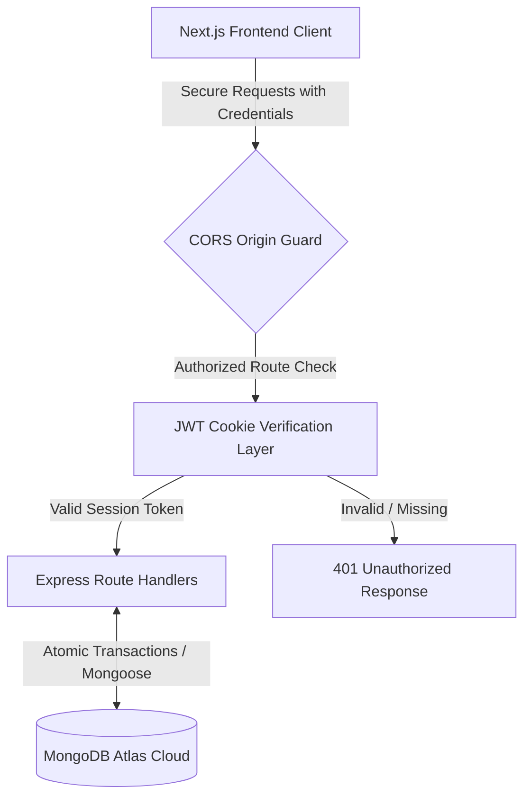

# 🛠️ DriveFleet API Engine

This is the full-stack, high-performance RESTful API engine powering **DriveFleet**, built using Node.js, Express, and MongoDB. It implements secure JWT lifecycle handshakes across HTTP-only cookies, automated MongoDB optimization aggregation parameters, and social auth parsing.

---

## 🏗️ System Pipeline Architecture

